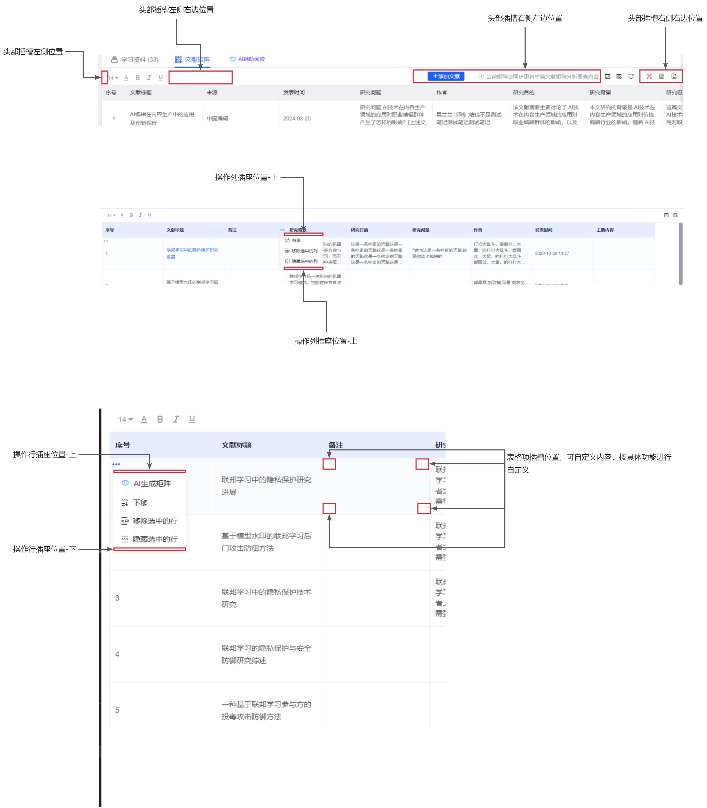

# 矩阵组件文档
## 前端文件地址
模块化引入地址：https://picx.cnki.net/search/common/xMatrix.m.js
全局引入地址：https://picx.cnki.net/search/common/xMatrix.js
## **安装**
### 在v2项目中
```html
import xMatrix from './xMatrix.m.js'
components: { xMatrix }
```
### 全局引用
> 全局引用须注意: vue 必须在window下，例如： window.Vue = vue
[matrix.md](matrix.md)
```vue
<!DOCTYPE html>
<html>
<head>
  <meta charset="UTF-8">
</head>
<body>
  <div id="app">
    <matrix>
    </matrix>
  </div>
</body>
  <!-- import Vue before Matrix -->
  <script src="./vue.js"></script>
  <!-- import JavaScript -->
  <script src="./xMatrix.js"></script>
  <script>
     window.Vue = Vue
    new Vue({
      el: '#app',
      data: function() {
        return { }
      }
    })
  </script>
</html>
```
## **组件**
```vue
<x-matrix
  ref="matrixRefs"
  :tableData="listData"
  :analyse-data="analyseData"
  :headersData="headersData"
  :matrix-config="confige"
  :loading="matrixLoading"
  @changeTableStyle="changeTableStyle"
  @chengeFontStyle="chengeFontStyle"
  @changeCheckbox="changeElementCheckbox"
  @changeTableItemContent="changeTableItemContent"
  @addElementValue="addElementValue"
  @editElementValue="editElementValue"
  @handleTableRowsSelect="handleTableRowsSelect"
  @handleTableColumnSelect="handleTableRowsSelect"
  @dbCurItem="dbCurItem"
  @curItemIndex="curItemIndex"
>
  <!-- 矩阵头部与矩阵体之前的插槽 -->
  <template slot="matrix-center"></template>
  <!-- 矩阵外头部插槽 最左侧、最左侧的右边、最右侧、最右侧左边 -->
  <template slot="header-left"></template>
  <template slot="header-left-right"></template>
  <template slot="header-right-left"></template>
  <template slot="header-right"></template>
  <!-- 矩阵体表格项插槽-位置：上下左右 -->
  <template v-slot:el-table-left-top="scopeTopData"></template>
  <template slot="el-table-right-top"></template>
  <template slot="el-table-left-bottom"></template>
  <template slot="el-table-right-bottom"></template>
  <!-- 操作行插槽 位置：上、下-->
  <template v-slot:tableRows-select-top="scopeRows"></template>
  <template slot="tableRows-select-bottom"></template>
  <!-- 操作列插槽 位置：上、下-->
  <template  v-slot:tableColumn-select-top="scopeColumn"></template>
  <template slot="tableColumn-select-bottom"></template>
  <!-- 矩阵尾部插槽 -->
  <template slot="header-right-left"></template>
</x-matrix>
```
## 属性（Attributes）
| 参数 | 说明 | 类型 | 可选值 | 默认值 |
| --- | --- | --- | --- | --- |
| tableData | 显示的数据 | array | — | — |
| analyseData | 分析要素数据 | array | — | — |
| headersData | 表头数据 | array | — | — |
| loading | 矩阵体加载 | boolean | — | false |
| matrixConfig | 矩阵配置项 | object | — | {} |

```javascript
{
  maxHeight:'600px', // 表格最大高 默认表格数据宽度,最大高以外部高度为准
  headersConfig:{
    // 字体大小,字体颜色,字体加粗,斜体,下划线 => 不传默认全部显示 || 不显示设置为空数组[]
    fontSizeSet:['fontSizeStyle','colorStyle','boldStyle','italicsStyle','underlineStyle'],
      // 平均分布各行,最合适的行高,平均分布各列,最合适的列宽,显示隐藏的行,显示隐藏的列 => 不传默认全部显示 || 不显示设置为空数组[]
    tableLayout:['averageRows','suitableLineHeight','averageColumn','suitableColumnWidth','showHideRows','showHideColumn'],
    tableLayoutType:{ // 不传默认aveRow:1,aveColumn:1,不固定第一列,averageColumnWidth:200
      aveRow:1,// 2  => 1:平均分布各行 2:最合适的行高
      aveColumn:1,// 2 => 1:平均分布各列 2:最合适的列宽 0: 使用保存数据的列宽 表头中的cellWidth字段
      index:'65', // 固定第一列宽度,不固定则不传入index字段
      averageColumnWidth: '200'  // 默认200 传入averageColumnWidth字段则自定义
    },
    analyseConfige:{ // 不显示设为空对象 {} => 不传则默认显示分析要素
      title:'要素', // 自定义名称 默认'分析要素'
    }
  },
  // 配置表头操作列功能  左移,右移,删除列,隐藏列 => 不传默认全部显示,空数组取消该功能
  tableHeader:['zuoyi','youyi','shanchulie','yincanglie'],
  // 配置列操作行功能 ai生成矩阵,上移,下移,删除行,隐藏行 => 不传默认全部显示,空数组取消该功能
  tableRows:['AI','shangyi','xiayi','shanchuhang','yincanghang']
}
```
```javascript
*数据说明
tableData           	为矩阵体数据 => 传入
  removeRowsDisabled  为是否可以参数行 1:不可删除 0:删除 以数据为主，如果tableRows配置可删除数据中配置不可删除，以数据为主
  cells               为行数据
  url              	 	为跳转地址(也就是表格项中含有url就可以跳转)
  factorId          	要素id表格中的每项与要素（表头）相联系 => 相当于表头是列管理，每行用此id一一对应每列
  表头 factorId 1                 |   factorId 2                 |   factorId 3
  一行 rows.cells[0].factorId 1   |   rows.cells[1].factorId 2   |   rows.cells[2].factorId 3
  二行 rows.cells[0].factorId 1   |   rows.cells[1].factorId 2   |   rows.cells[2].factorId 3
  三行 rows.cells[0].factorId 1   |   rows.cells[1].factorId 2   |   rows.cells[2].factorId 3
  ......
  content           	数据显示内容

    
  ***具体数据示例
  行数据:
  [
    {
      id:'xxx',
      hide:0,
      disabled:0,
      removeRowsDisabled:0
        cells:[
          {
            id:'xxx',
            url:'https://xxxxxx',
            content:'' 
          }
        ]
    },
    .....
  ]

      
headersData      			为表头数据, 与列数据类似
  id									唯一标识
  disabled          	为不可操作列 1:不可操作 0:可操作 操作范围=>左右移动隐藏删除列等
  hide              	可以与分析要素相互使用
  factorId          	要素id与表格中的每项相联系
  content           	数据显示内容
  cellWidth         	列宽 不传使用默认配置，默认配置不传默认200
  ***具体数据示例
  [
    {
      id:'xxx',
      disabled:0,
      hide:0,
      factorId:'xxx'  
    }
  ]


analyseData         	为分析要素数据 => 传入 可以等同于表头数据也可自定义数据
  hide              	可以与表头相互使用 1:为隐藏 2:为显示
  type              	是否可以编辑 1：不可编辑  2：为可编辑
  {
    id:'xxx',
    disabled:0,
    hide:0,
    type:2,
  }
```
## 事件(Events)
| 事件名 | 说明 | 参数 | 参数说明 |
| --- | --- | --- | --- |
| changeTableStyle | 当用户手动触发排布设置 | tableStyleType,type,cellWidthList | 整体表格设置数据，触发类型，各列宽 |
| changeCheckbox | 当用户切换勾选分析要素项 | data |  |
| changeTableItemContent | 当用户编辑完成矩阵某项 | data，curItemIndex |  |
| addElementValue | 当用户新增要素项点击'√'时触发 | data |
|
| editElementValue | 当用户编辑要素项点击'√'时触发 | data |  |
| handleTableRowsSelect | 当用户点击第一列'...'其中的某项触发 | type,rowsData |  |
| handleTableColumnSelect | 当用户点击表头中的'...'其中的某项触发 | type,columnData |  |
| dbCurItem | 用户触发编辑矩阵项 | data |  |
| curItemIndex | 用户点击矩阵中某项的回调 | data |  |

## 方法（Methods）
下载excel文件须配备xlsx插件使用cdn全局引入或按需加载传入xlsx插件地址

| 方法名 | 说明 | 参数 |
| --- | --- | --- |
| exportExcel | 导出表格 | name,xlsxUrl  > 表格名称，xlsx cdn地址 |
| handleDocumentClick | 关闭组件内显示的弹窗 |  |

## 插槽(Slot)
头部区域插槽没有数据，只为自定义功能使用。
操作行插槽通过 Scoped slot 可以获取到 行数据，列下标，列数据
操作列插槽通过 Scoped slot 可以获取到 行数据
表格项插槽通过 Scoped slot 可以获取到 行数据，列下表，列数据

